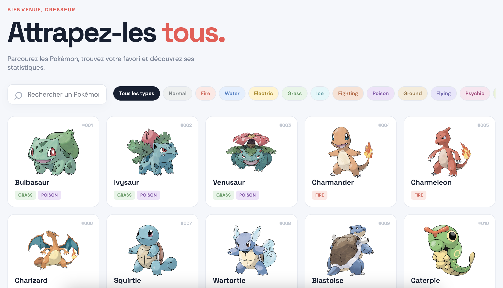

# Codex subagents configuration

Configuration personnelle des sous-agents Codex et de leur routage.

Ce dépôt constitue une source de vérité lisible et versionnée pour mon workflow
agentique local. Il ne contient ni credentials, ni données de projet, ni copie
complète de ma configuration machine.

## Philosophie du workflow

Le main agent reste le coordinateur. Il conserve le contexte global, comprend
la demande utilisateur, choisit les sous-agents pertinents et assemble leurs
résultats. La configuration locale par défaut est `gpt-6.1-sol` avec un
niveau de raisonnement `low` : son rôle est principalement de router, suivre
l'avancement et synthétiser les rapports, plutôt que de refaire lui-même toute
l'exploration ou l'implémentation. Il n'est donc pas nécessaire de lui attribuer
un raisonnement élevé par défaut : les décisions qui exigent réellement plus
de profondeur doivent être déléguées ou faire l'objet d'une escalade ciblée.

L'objectif principal est d'optimiser la consommation de tokens et de quota sans
sacrifier la qualité. On réserve le raisonnement coûteux aux problèmes qui le
justifient par des éléments observables : ambiguïté architecturale, couplage
inattendu, risque de sécurité, migration, concurrence, régression difficile à
expliquer ou échec de validation dont la cause reste incertaine.

Les rôles spécialisés utilisent le compromis suivant entre coût, rapidité et
profondeur de raisonnement :

| Rôle | Modèle utilisé | Raisonnement | Responsabilité |
| --- | --- | --- | --- |
| Main agent | `gpt-6.1-sol` | `low` | Coordination, routage et synthèse |
| `code-explorer` | `gpt-6-luna` | `high` | Exploration large et traçage des contrats |
| `architecture-advisor` | `gpt-6.1-sol` | `high` | Conseil architectural en lecture seule |
| `technical-advisor` | `gpt-6.1-sol` | `high` | Diagnostic technique ciblé en lecture seule |
| `implementer` | `gpt-6-luna` | `high` | Fonctionnalités, corrections et tests |
| `quick-implementer` | `gpt-6-luna` | `high` | Petits changements mécaniques ciblés |
| `code-reviewer` | `gpt-6.1-sol` | `high` | Revue indépendante en lecture seule |
| `commit-pusher` | `gpt-6-luna` | `low` | Commit et push explicitement demandés |

Pour les tâches d'implémentation bornées, `gpt-6-luna` avec un raisonnement
`high` est considéré comme suffisant dans ce workflow, y compris pour les
corrections qui demandent une analyse locale approfondie. On n'utilise pas un
palier plus coûteux comme `terra` par défaut : il ne doit être envisagé que si
des évaluations propres au dépôt montrent un meilleur taux de réussite, une
meilleure latence ou un coût total inférieur à la configuration actuelle.

Les deux implémenteurs restent sur Luna `high`. Leur distinction porte sur le
périmètre et les instructions, sans garantie de coût inférieur pour le profil
`quick-implementer`.

De même, un raisonnement `high` pour le coordinateur est une escalade, pas le réglage
normal du main agent. Avant d'augmenter le raisonnement, il faut vérifier que
le problème n'est pas simplement dû à un manque de contexte, à des critères
d'acceptation vagues, à une permission absente ou à une erreur d'environnement.

### Optimiser le coût de la tâche terminée

Sol low est le choix initial du coordinateur. Sol medium peut être choisi pour
un cadrage plus difficile, et Astra pour une coordination particulièrement
complexe. Ces choix sont explicites ; le routage ne change pas automatiquement
le modèle d'une session. Aucune économie globale n'est démontrée par ces seuls
réglages.
Le réglage du coordinateur est documenté ici, mais son `config.toml` n'est pas
versionné dans ce dépôt.

Le coût par token n'est pas le seul indicateur pertinent. Un modèle moins
coûteux qui nécessite plusieurs tentatives, corrections ou revues peut coûter
plus cher pour obtenir un résultat fiable qu'un modèle plus puissant qui réussit
en une seule passe.

Le choix d'un modèle doit donc prendre en compte :

- la consommation de tokens et de quota ;
- la probabilité d'une première implémentation correcte ;
- le nombre de cycles de correction ;
- le coût des tests et de la revue ;
- le temps nécessaire pour obtenir un résultat vérifiable.

Pour comparer deux configurations, observer des tâches comparables et relever
la consommation totale disponible, la durée, les cycles de correction et les
défauts découverts. Distinguer les tokens, les crédits et les limites du forfait ;
ne pas déduire une économie du seul nombre d'agents ou de messages affichés.

Le coordinateur transmet un mandat court : objectif, périmètre, contraintes,
critères d'acceptation et validation attendue. Il exploite les rapports reçus
sans refaire les recherches déjà couvertes. Les reprises d'une même tâche et
d'un même rôle privilégient l'agent existant ; un sujet indépendant ou un
contexte devenu inadapté justifie un nouvel agent avec un résumé ciblé.
La réutilisation évite parfois une nouvelle exploration, mais ne garantit pas
une consommation inférieure si l'historique accumulé est volumineux.

Chaque délégation annonce le rôle, le modèle, le raisonnement et la création ou
la reprise de l'agent. Les simples demandes de statut ne sont pas des
délégations et ne doivent pas devenir des interrogations répétitives inutiles.

### Escalader selon le périmètre de risque

La difficulté apparente n'est pas le seul critère de routage. Une refactorisation
complexe mais isolée peut rester adaptée à Luna, tandis qu'une modification
apparemment simple touchant l'authentification, les paiements, les permissions,
une migration ou une configuration de production justifie une revue attentive
par `code-reviewer`. Une décision architecturale complexe peut aussi justifier
une consultation de `architecture-advisor`.

L'escalade doit refléter l'impact potentiel d'une erreur, et pas seulement le
nombre de fichiers concernés.

### Escalader uniquement sur la base d'éléments observables

Lorsqu'un agent rencontre une difficulté, il faut d'abord vérifier si elle vient
d'un contexte incomplet, de critères d'acceptation vagues, de permissions
manquantes ou d'un problème d'environnement. Ces problèmes doivent être
corrigés directement plutôt que compensés par davantage de raisonnement.

Une escalade est justifiée par exemple par :

- un choix architectural encore non résolu ;
- un couplage inattendu entre plusieurs composants ;
- plusieurs hypothèses incorrectes malgré de nouvelles informations ;
- un échec de validation dont la cause reste inexpliquée ;
- un risque important de sécurité, compatibilité, migration ou concurrence.

Ces valeurs décrivent la configuration choisie, pas des garanties du
runtime. Elles doivent être relues lorsque les modèles disponibles ou les
conventions de Codex évoluent.

La politique de routage documentée décrit la stratégie d'escalade souhaitée.
Les définitions TOML versionnées représentent l'implémentation personnelle
actuelle de cette stratégie et peuvent utiliser un sous-ensemble plus restreint
des rôles ou modèles disponibles. Une différence entre la politique et les
fichiers agents doit donc être traitée comme un point à expliciter ou à corriger,
et non comme une capacité automatiquement disponible.

Les sous-agents ont des responsabilités spécialisées :

- `code-explorer` : exploration large, recherche de fichiers, traçage de
  contrats et compréhension d'un dépôt ;
- `architecture-advisor` : recommandation architecturale argumentée,
  alternatives, conséquences, risques et stratégie de migration ou validation ;
- `technical-advisor` : diagnostic d'une impasse technique, hypothèses étayées
  et prochaine vérification permettant de les départager ;
- `quick-implementer` : changements mécaniques, bien spécifiés et limités ;
- `implementer` : fonctionnalités, corrections et changements nécessitant des
  tests ou plusieurs fichiers ;
- `code-reviewer` : revue indépendante des changements terminés ;
- `commit-pusher` : commit et push, uniquement après demande explicite de
  l'utilisateur.

Le flux par défaut est :

```text
demande utilisateur
        ↓
analyse et routage par le main agent
        ↓
exploration si nécessaire
        ↓
implémentation
        ↓
tests et validation
        ↓
revue indépendante si le changement est significatif
        ↓
corrections et tests de non-régression
```

La délégation automatique est une règle de comportement, pas une garantie
mécanique. Le main peut traiter directement une tâche triviale ou déléguer une
tâche qui nécessite une exploration ou une implémentation spécialisée.

Une recherche ciblée pour localiser un fichier peut être réalisée directement.
L'explorateur intervient lorsque l'investigation nécessite de croiser plusieurs
modules ou de suivre des contrats et des flux de données.

Le conseiller architectural est facultatif : il ne constitue pas une étape du
flux par défaut. Le coordinateur le consulte pour une décision complexe aux
compromis significatifs, par exemple sur des frontières de modules, des contrats
partagés ou une migration difficile à inverser. Un bug difficile ou un échec
d'implémentation ne suffit pas à le déclencher. Les critères de consultation
figurent dans le routage ; le profil du conseiller définit sa méthode et ses
limites. Le coordinateur conserve la décision et transmet le choix retenu à
l'implémenteur. La revue du résultat reste indépendante.

Le conseiller technique est également facultatif. Luna signale au coordinateur
les observations, les essais déjà réalisés et une question précise. Si une
impasse concrète est établie, le coordinateur peut consulter Sol high puis
transmettre une orientation à Luna. Il n'est pas nécessaire d'attendre deux
cycles infructueux, mais un simple doute ne déclenche pas une consultation.
Le conseiller fournit une hypothèse argumentée et une vérification avec ses
résultats attendus ; l'implémenteur exécute et valide. Le raisonnement `high`
est le réglage des deux conseillers.

Une exploration peut précéder le conseil architectural pour identifier les
contrats existants. Si un diagnostic technique révèle un choix architectural,
le coordinateur décide si l'autre conseiller est utile : aucun enchaînement
automatique des deux. Les conseillers et le reviewer gardent des contextes
distincts. Les critères de consultation restent dans le routage, tandis que
les profils décrivent la méthode et les limites de chaque conseiller.

La validation est adaptée au changement : tests pertinents pour les comportements
modifiés, contrôles de syntaxe ou de cohérence pour les modifications mécaniques
de documentation et de configuration. Les vérifications impossibles et les
échecs préexistants doivent être explicités.

Le mandat de revue précise la base de comparaison, la version cible, les
fichiers ou portions concernés, les critères d'acceptation et les résultats de
validation. Le reviewer examine les changements pertinents, qu'ils soient
indexés, non indexés, nouveaux ou déjà commités, sans inclure le travail
préexistant hors périmètre. Un arbre de travail propre ne signifie pas qu'une
branche ne contient rien à revoir.

Après une revue demandant des corrections, l'implémenteur corrige et relance les
contrôles pertinents. Le reviewer conserve la base de comparaison et les
observations précédentes, vérifie les corrections et leurs effets, et élargit
la revue si le périmètre ou le risque le justifie. Si la même difficulté
persiste après deux tentatives de correction, le coordinateur reprend le
diagnostic et choisit une autre approche.

Lors d'une publication autorisée, `commit-pusher` vérifie la destination : sans
upstream, il ne suppose pas que le remote à utiliser est `origin`.

## Contenu du dépôt

- `agents/` contient les définitions TOML des sous-agents ;
- `rules/SUBAGENT_ROUTING.md` contient les règles de sélection et de séquencement ;
- `AGENTS.md` contient les instructions globales personnelles et la référence
  vers le routage installé ;
- ce README documente les manipulations manuelles et les choix du workflow.

Le dépôt ne versionne volontairement pas :

- `~/.codex/config.toml` en entier ;
- les données ou configurations spécifiques à un projet ;
- les chemins et réglages qui ne seraient utiles que sur une autre machine.

## Installation manuelle

Les opérations suivantes supposent que `$CODEX_HOME` vaut `~/.codex`. Si une
autre valeur est utilisée, remplacer ce chemin dans toutes les commandes.

### 1. Sauvegarder la configuration existante

```sh
cp -R ~/.codex ~/.codex.backup-$(date +%Y%m%d-%H%M%S)
```

### 2. Installer les agents

```sh
mkdir -p ~/.codex/agents
cp agents/*.toml ~/.codex/agents/
```

Avant de remplacer un agent existant, vérifier son contenu et conserver toute
personnalisation locale utile.

### 3. Installer les règles de routage

```sh
mkdir -p ~/.codex/rules
cp rules/SUBAGENT_ROUTING.md ~/.codex/rules/SUBAGENT_ROUTING.md
```

### 4. Référencer le routage dans `AGENTS.md`

Ajouter le bloc suivant dans `~/.codex/AGENTS.md`, en adaptant le chemin si
nécessaire :

```md
# BEGIN subagents_configs
@{Path}/.codex/rules/SUBAGENT_ROUTING.md
# END subagents_configs
```

Le fichier global peut également contenir les préférences personnelles de
rapport final présentes dans ce dépôt.

### 5. Activer la configuration multi-agent

La version actuelle de Codex active normalement le multi-agent par défaut.
Pour reproduire explicitement le réglage utilisé avec cette configuration,
ajouter à `~/.codex/config.toml` :

```toml
[features.multi_agent_v2]
hide_spawn_agent_metadata = false
tool_namespace = "agents"
```

Ne pas remplacer le `config.toml` existant : ajouter uniquement ce bloc si la
table n'existe pas déjà.

### 6. Redémarrer et vérifier

Redémarrer Codex ou ouvrir une nouvelle conversation. Tester ensuite une tâche
qui nécessite une exploration large, puis une implémentation et une revue.

Exemple de test reproductible :

```text
Crée un nouveau projet React nommé `pokedex-app` dans le répertoire courant.

Construis une interface web moderne de Pokédex avec :

- une grille de cartes Pokémon ;
- une recherche par nom ;
- des filtres par type ;
- une fiche détaillée au clic ;
- une pagination ou un chargement progressif ;
- des états de chargement, erreur et liste vide ;
- un design responsive desktop/mobile ;
- des composants React bien séparés ;
- des données provenant de l'API publique PokeAPI ;
- des tests pour la recherche, les filtres et l'affichage d'une carte ;
- des tests déterministes avec les appels réseau mockés ;
- un README avec les commandes d'installation, de lancement et de test.

Utilise Vite, TypeScript et une solution CSS simple.

Ne fais aucun commit ni push.
```

Le main agent devrait sélectionner les agents spécialisés lorsque la tâche le
justifie. Une demande explicite reste possible lorsqu'un agent précis est
nécessaire.

## Étude de cas : Pokédex React

Le workflow a été testé sur la création d'une application React/Vite/TypeScript
consommant PokeAPI.

La première implémentation compilait et ses tests initiaux passaient, mais la
revue indépendante a découvert un défaut fonctionnel important : la recherche
et les filtres ne s'appliquaient qu'aux 24 Pokémon déjà chargés. Un Pokémon
présent plus loin dans le Pokédex pouvait donc être déclaré absent.

L'agent d'implémentation a ensuite corrigé l'architecture en séparant un index
léger couvrant le Pokédex des détails chargés progressivement. La correction a
également ajouté des tests d'intégration, la gestion des réponses partielles,
la conservation du contexte lors d'un retry et une gestion accessible de la
modale.

Ce cas illustre l'intérêt de séparer production et évaluation : un code qui
compile et passe des tests locaux peut encore contenir une erreur dans
l'interaction réelle entre plusieurs fonctionnalités.



_Résultat final obtenu après un premier cycle complet du workflow agentique - implémentation, revue indépendante, corrections et validation - sans intervention manuelle supplémentaire._

## Validation des définitions TOML

Après toute modification d'un agent, vérifier que ses fichiers sont lisibles
avec le parseur TOML de la bibliothèque standard Python :

```sh
python3 - <<'PY'
from pathlib import Path
import tomllib

for path in sorted(Path("agents").glob("*.toml")):
    with path.open("rb") as f:
        tomllib.load(f)
    print(f"valid: {path}")
PY
```

Cette vérification contrôle la syntaxe TOML, mais pas la qualité des prompts,
la validité des modèles choisis ni la cohérence complète du routage. Ces points
doivent être vérifiés par revue et par un test réel sur une tâche limitée.

## Sécurité et gouvernance

- Les agents ne doivent pas recevoir plus de permissions que nécessaire.
- L'explorateur, le reviewer et les deux conseillers déclarent explicitement
  `sandbox_mode = "read-only"`. Les corrections sont confiées à l'implémenteur.
- `commit-pusher` ne doit jamais être lancé pour une simple demande de codage.
- Aucun commit ou push ne doit être effectué sans demande explicite.
- La validation doit être adaptée au changement : tests et builds pertinents
  pour le code, contrôles de syntaxe et de cohérence pour les modifications
  mécaniques. Signaler les vérifications impossibles et les échecs préexistants.
- Une revue indépendante est particulièrement utile après une modification
  multi-fichiers, une modification d'architecture ou un changement risqué.
- Les consignes globales doivent rester courtes ; les règles propres à un dépôt
  doivent être placées dans son propre `AGENTS.md`.

## Rapport final attendu

À la fin de chaque tâche de développement, le main agent doit résumer :

- les fichiers créés ou modifiés ;
- les commandes et tests exécutés ;
- les éventuels risques, limitations ou points restant à améliorer.

## Évolution

Les définitions d'agents et les règles de routage doivent être modifiées,
testées sur un petit dépôt, puis versionnées. Les changements de modèle ou de
fonctionnalité Codex doivent être vérifiés avec la documentation actuelle avant
d'être propagés à l'ensemble de la configuration.
